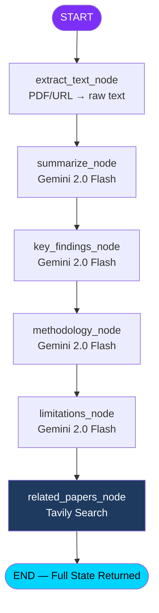

# ResearchBeacon — Planning-Based Research Paper Analyzer Agent

A LangGraph-powered agent that accepts research paper URLs or PDFs, performs multi-dimensional analysis, and presents results on a clean web interface hosted locally.

---

## Overview

**ResearchBeacon** is a full-stack application consisting of:
- A **LangGraph agent** backend orchestrating multiple analysis tasks via Google Gemini API (Gemini 2.0 Flash) + Tavily web search
- A **FastAPI** server exposing REST endpoints
- A **vanilla HTML/CSS/JS** single-page frontend served directly by FastAPI

---

## API Key Setup Guide

### 1. Google Gemini API (Gemini 2.0 Flash)
1. Go to [Google AI Studio](https://aistudio.google.com/) and sign in with your Google account.
2. Navigate to **Get API Key** and create a new key.
3. Copy the key (starts with `AIza...`).
4. The API is completely free under the standard tier (15 requests/min, 1M tokens/min).

### 2. Tavily (Web Search)
1. Go to [https://tavily.com](https://tavily.com) and create a free account
2. From your dashboard, copy your **API Key** (starts with `tvly-...`)
3. Free tier: 1,000 searches/month

Both keys will be stored in a local `.env` file — **never committed to git**.

---

## Project Structure

```
d:\Downloads\Gen AI Project\
└── research-beacon/
    ├── backend/
    │   ├── main.py               # FastAPI app entry point
    │   ├── agent/
    │   │   ├── __init__.py
    │   │   ├── state.py          # LangGraph AgentState (TypedDict)
    │   │   ├── nodes.py          # All LangGraph node functions
    │   │   ├── graph.py          # Graph construction & compilation
    │   │   └── tools.py          # Tavily search tool wrapper
    │   ├── utils/
    │   │   ├── __init__.py
    │   │   ├── pdf_parser.py     # PDF → text extraction (PyMuPDF)
    │   │   └── url_parser.py     # URL → text extraction (requests + BeautifulSoup + ArXiv)
    │   ├── requirements.txt
    │   └── .env                  # API keys (gitignored)
    ├── frontend/
    │   ├── index.html            # Main SPA
    │   ├── style.css             # All styling
    │   └── app.js               # Frontend logic
    └── README.md                 # Setup & run guide
```

---

## Proposed Changes

### Component 1 — Backend Setup & Dependencies

#### [NEW] `backend/requirements.txt`
All Python dependencies:
```
fastapi
uvicorn[standard]
python-dotenv
langgraph
langchain
langchain-google-genai    # For Gemini API
tavily-python
pymupdf                   # PDF parsing (fitz)
requests
beautifulsoup4
python-multipart          # For file upload in FastAPI
arxiv                     # ArXiv paper metadata + PDF download
lxml                      # BeautifulSoup XML/HTML parser
httpx
```

#### [NEW] `backend/.env`
```
GEMINI_API_KEY=AIza-your-key-here
TAVILY_API_KEY=tvly-your-key-here
```

---

### Component 2 — LangGraph Agent

#### [NEW] `backend/agent/state.py`
Defines the shared state passed between all nodes:
```python
class AgentState(TypedDict):
    paper_text: str          # Full extracted text
    paper_title: str         # Detected/extracted title
    source_type: str         # "pdf" | "url"
    source_ref: str          # Original URL or filename
    summary: str
    key_findings: str
    methodology: str
    limitations_future: str
    related_papers: list[dict]  # [{title, url, snippet}]
    qa_history: list[dict]   # [{question, answer}]
    error: str | None
```

#### [NEW] `backend/agent/nodes.py`
Individual LangGraph node functions. Each node receives the state, calls Gemini 2.0 Flash, and returns updated state fields:

| Node | Description |
|---|---|
| `extract_text_node` | Calls `pdf_parser` or `url_parser` based on input type |
| `summarize_node` | Generates a structured summary (abstract, purpose, scope) |
| `key_findings_node` | Extracts top contributions and novel results |
| `methodology_node` | Breaks down research design, datasets, models used |
| `limitations_node` | Identifies stated and unstated limitations + future work |
| `related_papers_node` | Uses Tavily to search for related/citing papers |
| `qa_node` | Answers a user question grounded in `paper_text` |

#### [NEW] `backend/agent/graph.py`
LangGraph graph flow:
```
START
  → extract_text_node
  → summarize_node
  → key_findings_node
  → methodology_node
  → limitations_node
  → related_papers_node
END (full analysis state returned)

Separate QA graph:
START → qa_node → END
```

> Sequential flow is used (not parallel) to keep token usage predictable and avoid rate limiting on free-tier API keys.

#### [NEW] `backend/agent/tools.py`
Wraps `TavilyClient` for academic-biased search (title + "research paper" as query enrichment).

---

### Component 3 — Text Extraction Utilities

#### [NEW] `backend/utils/pdf_parser.py`
Uses **PyMuPDF (fitz)** to extract text from uploaded PDF:
- Handles column layouts, text blocks
- Strips headers/footers heuristically
- Returns clean text string

#### [NEW] `backend/utils/url_parser.py`
Smart URL handler with routing logic:
- **ArXiv URLs** (`arxiv.org/abs/...` or `arxiv.org/pdf/...`): Uses `arxiv` library to fetch metadata + full PDF → parsed with PyMuPDF
- **Semantic Scholar / PubMed**: Fetches HTML → extracts abstract + metadata via BeautifulSoup
- **General URLs**: Downloads page HTML → strips boilerplate → extracts meaningful text
- **Direct PDF links**: Downloads PDF → parsed with PyMuPDF

---

### Component 4 — FastAPI Backend

#### [NEW] `backend/main.py`
Endpoints:

| Method | Path | Description |
|---|---|---|
| `POST` | `/api/analyze/url` | Accepts `{ url: str }`, runs full analysis graph |
| `POST` | `/api/analyze/pdf` | Accepts `multipart/form-data` with PDF file, runs full analysis |
| `POST` | `/api/qa` | Accepts `{ paper_text: str, question: str }`, returns answer |
| `GET` | `/` | Serves `frontend/index.html` |
| `GET` | `/static/{path}` | Serves CSS/JS |

- CORS enabled for localhost
- Pydantic models for request/response validation
- Error handling with meaningful HTTP status codes

---

### Component 5 — Frontend

#### [NEW] `frontend/index.html`
Single-page app with:
- **Header**: ResearchBeacon logo + tagline
- **Input Section**: Two tabs — "Paste URL" and "Upload PDF"; drag-and-drop zone for PDF
- **Analyze Button**: Triggers API call
- **Loading State**: Animated spinner with step indicators (Extracting → Summarizing → Finding → Analyzing → Searching)
- **Results Section** (hidden until analysis complete): Tabbed/card layout:
  - 📋 Summary
  - 🔑 Key Findings & Contributions
  - 🔬 Methodology
  - ⚠️ Limitations & Future Work
  - 🔗 Related Papers (with clickable links)
- **Q&A Section**: Input box + submit button + conversation history
- **Download Button**: "Download as PDF" (appears after analysis; uses `html2pdf.js`)

#### [NEW] `frontend/style.css`
Design system:
- **Theme**: Dark mode with deep navy (`#0a0f1e`) and accent electric blue/cyan gradient
- **Typography**: Inter (Google Fonts)
- **Cards**: Glassmorphism style (frosted glass effect)
- **Animations**: Fade-in for results, shimmer loading states, hover effects on cards
- **Tabs**: Smooth animated tab switching
- **Color palette**:
  - Background: `#0a0f1e`
  - Surface: `rgba(255,255,255,0.05)` (glass)
  - Accent: `#00d4ff` → `#7b2ff7` gradient
  - Text: `#e2e8f0`
  - Muted: `#64748b`

#### [NEW] `frontend/app.js`
- Tab switching logic
- Drag-and-drop PDF upload
- `fetch()` calls to FastAPI
- Rendering analysis sections progressively
- Q&A conversation loop
- `html2pdf.js` integration for PDF download (CDN, no install needed)

---

### Component 6 — README

#### [NEW] `README.md`
Complete setup guide covering:
1. Creating virtual environment
2. Installing dependencies
3. Setting up `.env` with API keys
4. Running the server
5. Accessing the app at `http://localhost:8000`

---

## LangGraph Flow Diagram



---

## Verification Plan

### Automated
- Run `uvicorn backend.main:app --reload` and confirm server starts on port 8000
- Test `/api/analyze/url` with an ArXiv link via `curl` or browser
- Test `/api/analyze/pdf` with a sample PDF upload

### Manual (Browser)
- Open `http://localhost:8000`
- Test URL input tab with an ArXiv link
- Test PDF upload tab with drag-and-drop a local PDF
- Verify all 5 analysis sections populate correctly
- Test Q&A input with a paper-specific question
- Click "Download as PDF" and verify the report downloads

---

> [!IMPORTANT]
> Google AI Studio provides a very generous free tier for Gemini 2.0 Flash (15 requests per minute, 1,000,000 tokens per minute). This allows you to run full paper analysis completely for free.

> [!NOTE]
> Tavily's free tier gives 1,000 searches/month — more than sufficient for local development and testing.
